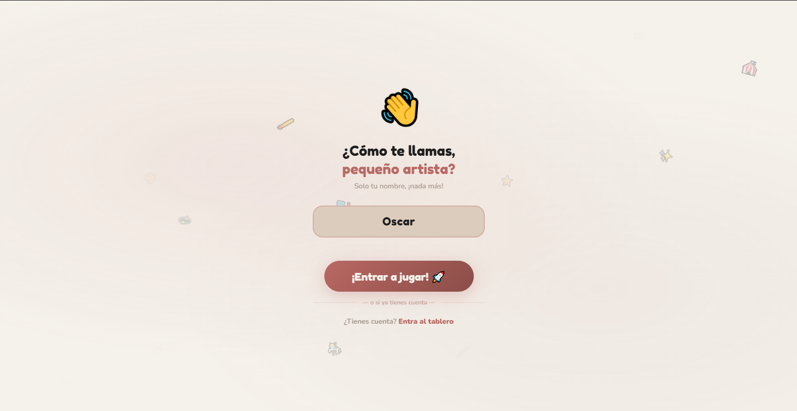
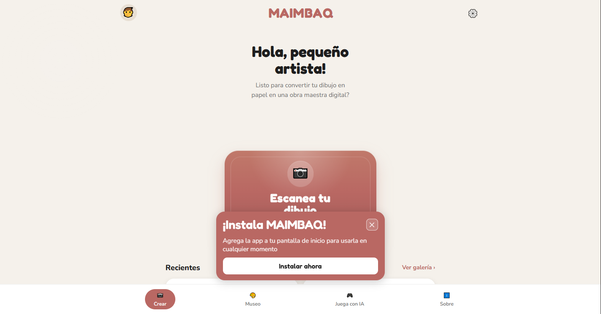
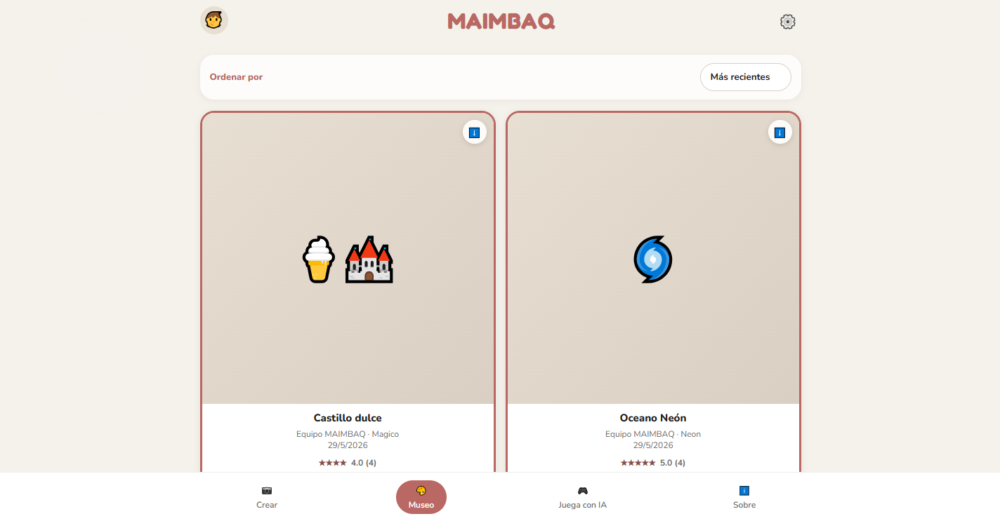
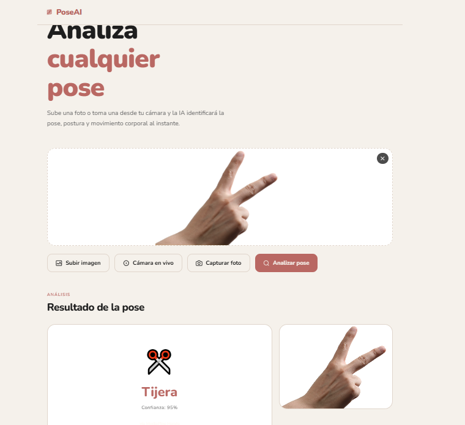
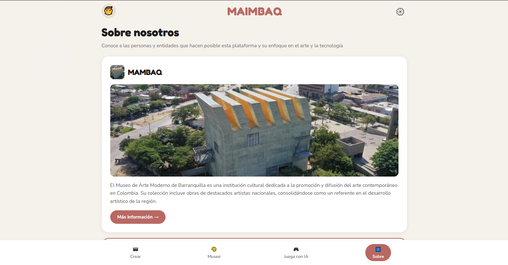

# MAIMBAQ

[](https://html.spec.whatwg.org/)
[](https://www.w3.org/Style/CSS/)
[](https://developer.mozilla.org/es/docs/Web/JavaScript)
[](https://nodejs.org/)
[](https://expressjs.com/)
[](https://www.mongodb.com/)
[](https://www.tensorflow.org/)
[](https://web.dev/progressive-web-apps/)
[](LICENSE)

Aplicación web interactiva que transforma dibujos en experiencias digitales y los presenta en un museo virtual. MAIMBAQ combina una interfaz móvil-first con un backend en Node.js + MongoDB, integrando IA para análisis de poses con MediaPipe y TensorFlow.

## Qué incluye

- 🎨 Conversión de dibujos en obras digitales mediante herramientas de procesamiento visual.
- 🤖 Análisis de poses con inteligencia artificial utilizando MediaPipe y TensorFlow.
- 🏛️ Museo interactivo para explorar y visualizar las obras creadas.
- 📱 Flujo intuitivo de usuario: crear, procesar y visualizar resultados.
- 🔔 Compatibilidad con PWA para una experiencia más accesible desde distintos dispositivos.
- 🎭 API REST para la gestión de obras digitales mediante operaciones CRUD.
- 📚 Documentación técnica y guías de uso del proyecto.
- 🎯 Diseño inspirado en museos y espacios culturales digitales.

## Galería de Pantallas

### Página Principal


_Interfaz de bienvenida con onboarding interactivo y acceso personalizado por nombre del usuario._

### Dashboard


_Centro de control con acceso rápido a las principales funciones de la aplicación._

### Crear Obra


_Interfaz para capturar o subir dibujos y convertirlos en obras digitales._

### Museo Virtual


_Galería interactiva mostrando todas las obras creadas y compartidas por la comunidad._

### Análisis de Poses (PoseAI)


_Herramienta de IA que analiza poses corporales con MediaPipe + TensorFlow en tiempo real._

### Sobre Nosotros


_Información sobre el equipo, organización y propósito de MAIMBAQ._

## Despliegue en Heroku (cómo lo hicimos)

Adjunto aquí los pasos y las capturas que usamos para desplegar la app en Heroku.

Pasos resumidos:

1. Asegurar que el repositorio ignore dependencias, builds y archivos sensibles (`.gitignore`).

2. Añadir un `Procfile` para indicar a Heroku cómo iniciar la app. Ejemplos comunes:
   - Para que heroku sirva para el build de Docusaurus:

   ```text
   web: npm run start --prefix website
   ```

   - O para que Heroku ejecute el backend Express:

   ```text
   web: npm --prefix backend start
   ```

3. Prepararamos el `website/package.json` para que Heroku ejecute el build antes de start (ej. `heroku-postbuild`), y un `server.js` que sirva `website/build` con Express.

4. Commit y push al remoto de Heroku:

```bash
git add .
git commit -m "Prepare for Heroku deploy"
heroku login
heroku create maimbaq-dba2ec399b00
App pública: https://maimbaq-dba2ec399b00.herokuapp.com/
git push heroku main
```

5. Configurar variables de entorno (por ejemplo `MONGODB_URL`) en Heroku:

```bash
heroku config:set MONGODB_URI="mongodb+srv://..."
```

Capturas:

- Crear app en Heroku (ej. `heroku create`):

  

  

- Push a Heroku (`git push heroku main`):

  

- Subida exitosa:

  

## Ejecución local

### Frontend

- Abre `index.html` directamente en el navegador, o usa un servidor local.
- Si prefieres servidor, desde la raíz del proyecto:

```bash
npx serve .
```

### Backend

```bash
cd backend
npm install
npm run dev
```

Después abre `http://localhost:5000`.

## Configuración de entorno

Crea un archivo `.env` en `backend/` con al menos estas variables:

```env
PORT=5000
MONGODB_URI=mongodb://localhost:27017/maimbaq
```

Opcional:

```env
CLIENT_ORIGIN=http://localhost:3000
NODE_ENV=development
```

## API REST

### Base URL

- Local: `http://localhost:5000/api`
- Production: `https://tu-api.com/api`

### Endpoints

#### Health Check

```http
GET /api/health
```

Respuesta:

```json
{
  "status": "ok",
  "message": "Server is running"
}
```

#### Listar todas las obras

```http
GET /api/artworks
```

Respuesta:

```json
{
  "success": true,
  "data": [
    {
      "_id": "507f1f77bcf86cd799439011",
      "title": "Dinosaurio Espacial",
      "artist": "Carlos",
      "style": "Fantasía",
      "imageUrl": "https://..."
    }
  ]
}
```

#### Obtener obra por ID

```http
GET /api/artworks/:id
```

#### Crear nueva obra

```http
POST /api/artworks
Content-Type: application/json

{
  "title": "Dinosaurio Espacial",
  "artist": "Carlos",
  "style": "Fantasía",
  "imageUrl": "https://..."
}
```

#### Actualizar obra

```http
PATCH /api/artworks/:id
Content-Type: application/json

{
  "title": "Nuevo título",
  "style": "Realismo"
}
```

#### Eliminar obra

```http
DELETE /api/artworks/:id
```

Para documentación interactiva completa, consulta [docs/api/README.md](docs/api/README.md).

## Documentación adicional

- [API Documentation](docs/api/README.md) — endpoints detallados y ejemplos
- [Requirements](docs/requirements/README.md) — requisitos funcionales y técnicos
- [API Spec (OpenAPI)](docs/api/swagger.json) — especificación OpenAPI/Swagger

## Paleta de Colores

La aplicación utiliza una paleta de colores culturalmente contemporánea inspirada en museos, archivos y revistas literarias:

- **Primario (Terracota)**: `#B96863`
- **Primario Oscuro**: `#8B4D48`
- **Beige (Papel)**: `#DCCCBD`
- **Marfil (Fondo)**: `#F5F1EB`
- **Negro Carbón (Texto)**: `#1E1E1E`
- **Verde Natural**: `#6B8A4F`
- **Rojo Natural**: `#C4645A`

## Tecnologías Principales

- **Frontend**: HTML5, CSS3, JavaScript vanilla, PWA
- **Backend**: Node.js, Express.js, Mongoose
- **Database**: MongoDB
- **IA**: MediaPipe, TensorFlow.js
- **Deploy**: GitHub Pages (frontend), cualquier servidor Node (backend)

## Contribuir

1. Haz fork del repositorio.
2. Crea una rama nueva: `git checkout -b feature/mi-feature`.
3. Haz commit de tus cambios.
4. Envía un pull request.

## Licencia

MIT - Ver [LICENSE](LICENSE) para más detalles.

---

Hecho con foco en experiencia de dibujo y arte digital. 🎨✨
Espero les guste este grandiosisimo proyecto, para que todos los niños y niñas de toda barranquilla suban su hermosa creatividad, se que tendrán muy buenas obras
